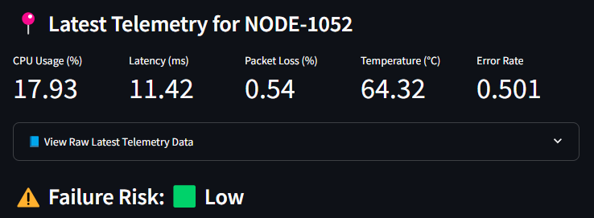
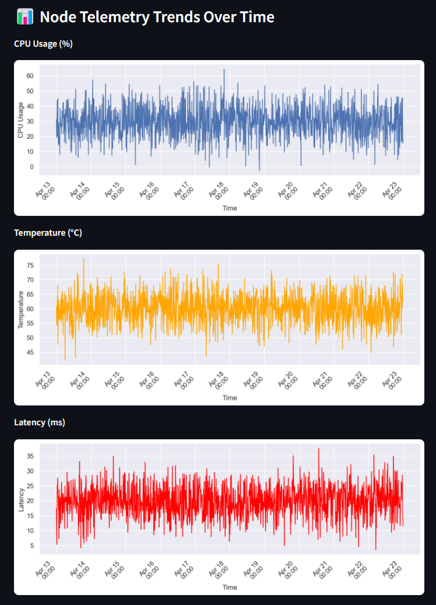

# 🛰 Digital Twin - Predictive Maintenance Dashboard

A real-time machine learning dashboard simulating Comcast's network infrastructure using **PySpark**, **Scikit-learn**, and **Streamlit**.  
This project implements a **Digital Twin** to monitor virtual network nodes, detect anomalies, and predict failure risks using telemetry data.

---

## 📊 Project Highlights

- ✅ **Digital Twin Simulation**: Generates synthetic telemetry for network nodes (CPU, latency, packet loss, etc.)
- ⚡ **PySpark Processing**: Scalable data ingestion and feature engineering using Spark DataFrames
- 🧠 **ML Model (Random Forest)**: Predicts node failure risks using real-time sensor patterns
- 📈 **Streamlit Dashboard**: Interactive web app for monitoring node health and trends
- 💄 **Sleek UI**: Seaborn charts, custom CSS metrics, dark mode, responsive layout

---

## 📸 Screenshots

### ⚠️ Real-Time Failure Risk

### 📈 CPU, Temp, Latency Charts

### 📊 Responsive Metric Cards

> You can customize colors and themes in `.streamlit/config.toml`.

---

## 📁 Folder Structure

<pre> comcast-digital-twin-ml/ ├── data/ # Raw + processed telemetry CSVs ├── notebooks/ # Jupyter notebooks (data + modeling) ├── scripts/ # Data simulation script ├── app/ │ └── dashboard.py # Streamlit app ├── .streamlit/ │ └── config.toml # Dark mode + UI theme ├── README.md └── requirements.txt </pre>
